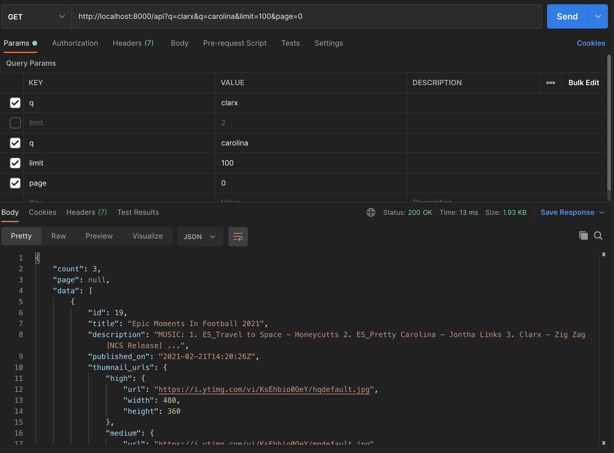
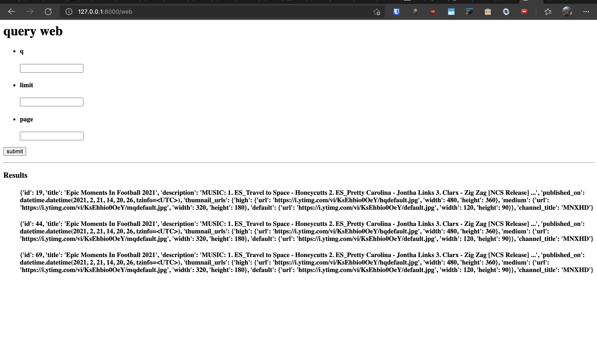

### Fampay assignement

1. Used `black` formatter for Py code
2. Uses Postgres 11+ DB
3. Uses Django 3.2.x
4. Requires Python 3.6.x

## Screenshots





## Features

1. Supports full text search using search vector functionality in full text search of postgres
2. Uses schedule to periodically fetch Youtube API data
3. Sample curl

```
curl --location --request GET 'http://localhost:8000/api?q=clarx&q=carolina&limit=100&page=0'
```
4. Web view is on `localhost:8000/web`

## Local setup

1. create Py 3 virtualenv 
2. Install requirements as
```
pip install -r requirements.txt
```
3. Make `.env` and add proper conf in it based on [.sample-env](.sample-env)